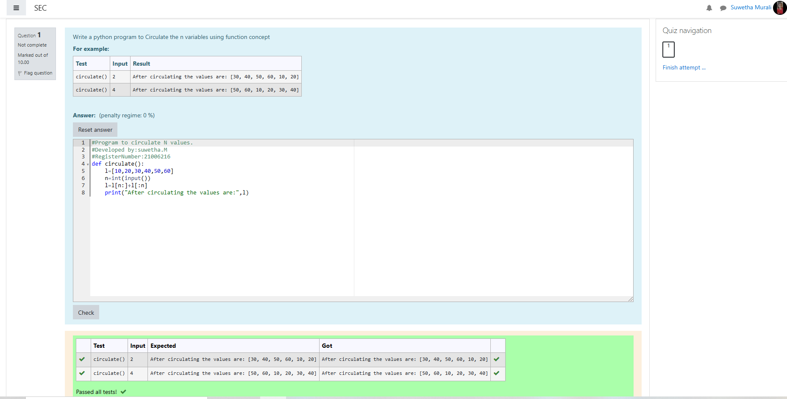

# Circulate-the-values-of-N-variables
## Aim:
To write a python program to circulate the n variables using function concept
## Equipment’s required:
PC
Anaconda - Python 3.7
## Algorithm: 
### Step 1: 
Commence the program
### Step 2: 
Get the value from the user for the number of rotation
### Step 3: 
Get the value from the user for the number of rotation
### Step 4: 
Using the slicing concept rotate the list

### Step 5:
Print the rotated list

### Step 6: 
End the program
## Program:#Program to circulate N values.
```
#Developed by:suwetha.M 
#RegisterNumber:21006216
def circulate():
    l=[10,20,30,40,50,60]
    n=int(input())
    l=l[n:]+l[:n]
    print("After circulating the values are:",l)
```
### Output:


## Result:
The variables are rotated sucessfully